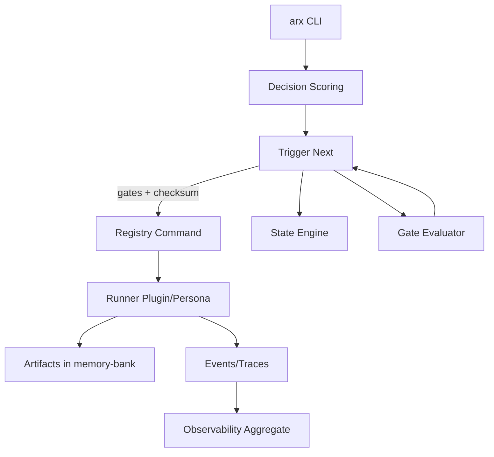

# AdvancedRules Framework — Canonical System Reference

Canonical: Yes
Version: 2.0.0
Last Updated: 2025-09-01
Related: `docs/INTEGRATION_GUIDE.md`, `docs/METRICS_RUNBOOK.md`, `docs/governance_policy.md`, `docs/instrumentation_policy.md`, `docs/VALIDATION_SUITE_STRUCTURE.md`

## Scope
Definitive reference for architecture, workflows, rules engine, state, execution, observability, and interfaces of the AdvancedRules framework.

## Key Artifacts & Logs
- Events: `logs/events.jsonl`
- Decision traces: `logs/decision_traces.jsonl`
- Provenance index: `memory-bank/artifacts_index.json`
- Rule attach log: `rule_attach_log.json`
- Rules index: `memory-bank/rules_index.json`
- Workflow state: `workflow_state.json` (schema: `schemas/workflow_state.schema.json`)
- Registry: `.cursor/commands/registry.yaml` + checksum `.cursor/commands/registry.sha256`
- Envelope samples: `action_envelope.json`, `action_envelope_cmd.json`, `tools/envelopes/action_envelope_v2.json`

### Schemas (Contracts)
- `schemas/workflow_state.schema.json`, `schemas/registry.schema.json`, `schemas/flow_schema.json`
- `schemas/candidates.schema.json`, `schemas/events_envelope.schema.json`
- `schemas/memory/*.schema.json`, `schemas/memory_doc_schema.json`, `schemas/metrics_schema.json`

---

## Architecture Overview

### Components
- Orchestrators: decision scoring, trigger, state engine, gate evaluator, post‑run (`tools/orchestrator_postrun.py`; policy: `.cursor/rules/orchestrator_postrun.mdc`)
- Personas: PO/Planning/PE/Auditor via `tools/runner/plugins/*`; QA/Security/Deploy via `tools/plugins/*`
- Rules Engine: `.mdc` rules parsing, linting, indexing, enforcement
- Declarative Flows: DAG with guards, edges, retries (`flow/flow_registry.yaml` ↔ `tools/flow/flow_runner.py`)
- Memory-bank: artifacts, plans, reports with provenance & validation
- Observability: Prometheus exporter, events/traces, redaction policy
- Queue: Redis + Celery workers (`exec_queue/**`, `workers/**`)

### Relationships (high level)


### Runtime Data Flow
```mermaid
sequenceDiagram
  participant User
  participant CLI as arx CLI
  participant Scorer as decision_scoring/advanced_score.py
  participant Trigger as tools/orchestrator/trigger_next.py
  participant Gates as tools/gates/gate_evaluator.py
  participant State as tools/orchestrator/state.py
  participant Persona as tools/runner/plugins/*
  participant MB as memory-bank/*
  participant Obs as logs/*
  User->>CLI: invoke command (orchestrate)
  CLI->>Scorer: score candidates
  Scorer-->>CLI: decision {NEXT_STEP|OPTION_SET|ASK_CLARIFY}
  CLI->>Trigger: map to registry; enforce allowlist + checksum
  Trigger->>Gates: evaluate gates/contexts
  Gates-->>Trigger: pass/fail
  Trigger->>State: transition (idempotent)
  Trigger->>Persona: execute (dry‑run by default)
  Persona->>MB: emit validated artifacts
  Persona->>Obs: append events + traces
```

---

## Rules Engine

### Sources
- Files: `.cursor/rules/**.mdc`
- Linter: `tools/rules/mdc_linter.py`
- Indexer: `tools/rules/index_generator.py` → `memory-bank/rules_index.json`
- Policy validator: `tools/rules/validate.py`

### Frontmatter Example
```yaml
---
title: "TypeScript Best Practices — v1"
description: "TypeScript coding standards and best practices"
globs: ["**/*.ts", "**/*.tsx"]
alwaysApply: false
priority: medium
---
```

### Enforcement & Gates
- Lint frontmatter, globs, attachments, required artifacts
- Build reverse maps (gates→rules, artifacts→rules, globs→rules)
- Evaluate gates via `tools/gates/gate_evaluator.py` (uses rules index)
- Roles must not auto‑attach nor be `alwaysApply:true`

### Decision Scoring
- Weights/thresholds/calibration in `tools/decision_scoring/*.json`
- Scoring API: `tools/decision_scoring/advanced_score.py`
- Output: `NEXT_STEP` | `OPTION_SET` | `ASK_CLARIFY` | `RISK_ALERT`

---

## Flows & Execution

### Declarative Flows
- Registry: `flow/flow_registry.yaml`
- Engine: `tools/flow/flow_runner.py`
- Features: DAG, `when:` conditions, retries, timeouts, guards

### Trigger & Safety
- Trigger: `tools/orchestrator/trigger_next.py` (allowlist `arx` and `python3 tools/run_role.py`)
- Checksum: verifies `.cursor/commands/registry.sha256`
- Dry‑run default: set `ALLOW_RUN=1` to execute; `ALLOW_WRITES=1` for live writes (flows/Celery)

### Workers & Queue
- Celery app: `exec_queue/celery_app.py` (Redis broker/backend)
- Task: `exec_queue/tasks.py` (rate limits, idempotency keys)
- Worker entry: `workers/flow_worker.py` (`ARX_WORKER_QUEUE`, `ARX_WORKER_CONCURRENCY`)

---

## Configuration & CLI

### Environment Variables
- Safety: `ALLOW_RUN`, `ALLOW_WRITES`, `CI`, `GITHUB_ACTIONS`, `ENABLE_REDACTION`
- Queue: `AR_REDIS_HOST`, `AR_REDIS_PORT`, `CELERY_BROKER_URL`, `CELERY_RESULT_BACKEND`
- Worker: `ARX_WORKER_QUEUE`, `ARX_WORKER_CONCURRENCY`
- Observability: `AR_METRICS_PORT`, `AR_METRICS_ADDR`

### CLI Entrypoints
- Flows/Tasks/Memory/Obs: `arx` (entry `cli/main.py`)
- Observability help: `arx obs serve --port=<port>`

---

## Persistence
- Workflow state: `workflow_state.json` (see schema)
- Artifacts validated/emitted via `tools/runner/io_utils.py`
- Events/Traces persisted under `logs/`

---

## Deployment & Ops
- Quickstart: `tools/prestart/prestart_composite.py`, `tools/quickstart.py`
- Flows: `arx flow lint`, `arx flow run --dry-run`
- Decision + Trigger: `tools/decision_scoring/advanced_score.py`, `tools/orchestrator/trigger_next.py`
- Observability: `arx obs serve --port=<port>`, `tools/observability/aggregate.py`
- Governance: `tools/rules/validate.py`, `tools/schema/validate_artifacts.py`, `tools/gates/gate_evaluator.py`

---

## Extensibility
- Add persona: `tools/runner/plugins/` (or `tools/plugins/`) + registry entry
- Add rules: new `.mdc`, lint & index; gates derive required artifacts
- Add flows: update `flow/flow_registry.yaml`, run `FlowRunner`

---

## Examples
```bash
python3 tools/decision_scoring/advanced_score.py
python3 tools/orchestrator/trigger_next.py --dry-run --auto-candidates
arx flow lint --flow=feature_request_to_pr
```

---

## Gaps & Open Points
- Centralized “reusables catalog” for naming/components: not present (rules cover conventions)
- UI/UX validation artifacts: not present (only usage standards in `.cursor/rules`)
- API endpoint tests: e2e tests exist; no REST API suite

---

## Revision History
- 2025‑09‑01: Canonical doc created by consolidation of Developer/Technical docs; aligned with governance & integration guides; added artifacts/logs map and schemas list.

