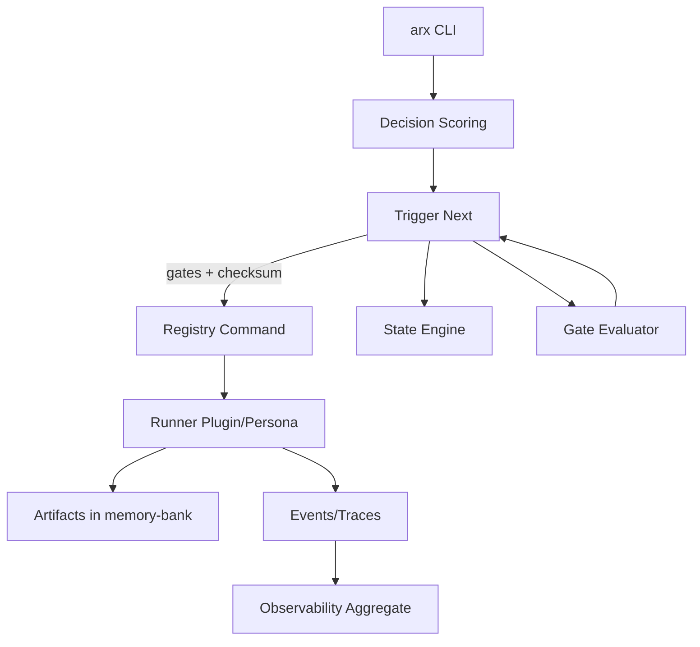
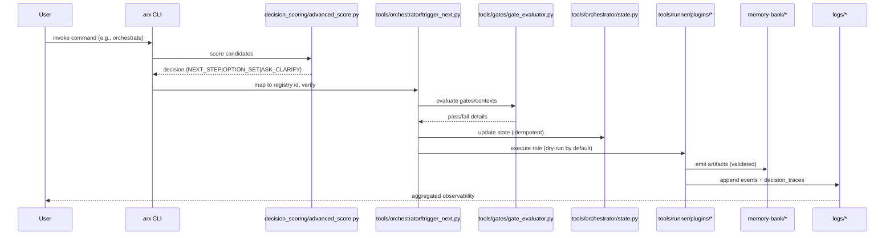
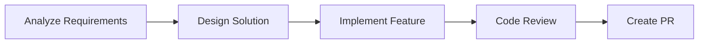

# AdvancedRules Framework — Technical Documentation

## Overview
AdvancedRules is an AI-driven project management and software delivery framework that orchestrates specialized AI personas, enforces domain-specific rules, and automates planning, audit, and execution workflows with strong governance.

- Domain rules: `.cursor/rules/**`
- Operational tools: `tools/**`
- CLI: `arx` (entrypoint `cli/main.py`)
- Flows: `flow/flow_registry.yaml`
- State: `workflow_state.json` (schema in `schemas/workflow_state.schema.json`)
- Queue & workers: `exec_queue/**`, `workers/**`

---

## 1) Architecture Overview

### Components
- Orchestrators: decision scoring, trigger, state engine, gate evaluator, post-run
- Personas: runner plugins per role (product owner, planning, PE, QA, security, auditor)
- Rules Engine: `.mdc` rules parsing, linting, indexing, enforcement
- Declarative Flows: DAG definitions with guards, edges, retries
- Memory-bank: artifacts, plans, reports with provenance and validation
- Observability: metrics, events, decision traces, redaction policy
- Queue: Redis + Celery workers for scalable background execution

### Relationships (high level)


### Runtime Data Flow


---

## 2) Rules Engine Implementation Details

### Sources
- Files: `.cursor/rules/**.mdc`
- Linter: `tools/rules/mdc_linter.py`
- Indexer: `tools/rules/index_generator.py` → `memory-bank/rules_index.json`
- Policy validator: `tools/rules/validate.py`

### Rule format (frontmatter)
```yaml
---
description: "What this rule does"
globs: ["**/*.ts"]
alwaysApply: false
---
```

### Enforcement
- Lint: validates frontmatter, globs, attachments, required artifacts
- Index: builds reverse maps for gates→rules, artifacts→rules, globs→rules
- Gate evaluator: enriches runtime checks via rules index
- Role guardrails: roles must NOT auto-attach or set alwaysApply

Key snippets:
```12:38:tools/rules/validate.py
for f in (ROOT / ".cursor/rules/roles").glob("*.mdc"):
    txt = f.read_text(encoding="utf-8")
    m = re.search(r"^globs:\s*\[(.*?)\]\s$", txt, re.M)
    ...
```
```1:67:tools/orchestrator/state.py
def transition(new_state: str, correlation_id: str | None = None) -> Dict[str, Any]:
    """Idempotent transition. Writes only when the state changes."""
    data = load_state()
    cur = data.get("state")
    ...
```
```107:205:tools/gates/gate_evaluator.py
def evaluate_gates() -> Dict[str, Any]:
    commands = _load_registry()
    state = _load_state()
    attach = _load_attachments()
    attached_domains = _domains_attached(attach)
    rules_index = _load_rules_index()
    ...
```

### Decision Scoring Policy
- Weights: intent, state, evidence, recency, pref; cost and risk_penalty negative
- Thresholds: conf_high → NEXT_STEP; conf_mid with small gap → OPTION_SET; else ASK_CLARIFY/RISK_ALERT

```1:125:tools/decision_scoring/advanced_score.py
DEFAULT_WEIGHTS = {"intent":0.30, ...}
DEFAULT_THRESH  = {"conf_high":0.75, ...}
...
result["decision"] = {"type":"NEXT_STEP"|"OPTION_SET"|"ASK_CLARIFY"|"RISK_ALERT"}
```

---

## 3) Workflow Diagrams and Process Flows

### Declarative Flows
- Registry: `flow/flow_registry.yaml`
- Executed by: `tools/flow/flow_runner.py`
- Features: DAG, guards, retries, timeouts, conditions, action envelope v2

```1:120:flow/flow_registry.yaml
flows:
  feature_request_to_pr:
    guards: [branch_not_main, dry_run_unless_allowed, artifacts_present, git_clean]
    nodes: {analyze_requirements, design_solution, implement_feature, code_review, create_pr}
    edges: when conditions control transitions
```

Flow execution engine:
```1:120:tools/flow/flow_runner.py
class FlowRunner:
  def execute_flow(...):
    _execute_flow_guards()
    dag = _build_execution_dag()
    results = _execute_dag()
    summary = _generate_execution_summary()
```

### Orchestration Trigger
```1:295:tools/orchestrator/trigger_next.py
- Loads registry
- Scores candidates
- Enforces gates
- Verifies registry checksum
- Enforces allowlist (arx, tools/run_role.py)
- Executes or enqueues (optional)
```

### Mermaid: Feature Request to PR


---

## 4) Configuration and Customization

### Environment Variables
- Safety: `ALLOW_RUN`, `ALLOW_WRITES`, `CI`, `GITHUB_ACTIONS`, `ENABLE_REDACTION`
- Queue: `AR_REDIS_HOST`, `AR_REDIS_PORT`, `CELERY_BROKER_URL`, `CELERY_RESULT_BACKEND`
- Observability: `AR_METRICS_PORT`, `AR_METRICS_ADDR`

### CLI Entrypoints
```12:66:cli/main.py
subcommands: flow, tasks, memory, obs
- arx flow lint|run|render|list
- arx tasks plan|print|export
- arx memory index|query|stats|purge
- arx obs serve --port --addr
```

### Registry Commands and Gates
```1:239:.cursor/commands/registry.yaml
commands:
  - id: planning-to-audit
    requires: { states_any_of: ["PLANNING_DONE"], gates_passed_all_of: ["PLANNING_GATE"] }
    contexts: { must_exist: ["memory-bank/plan/Action_Plan.md"] }
```

### Rules Index
- Generate: `python3 tools/rules/index_generator.py --check-parity`
- Output: `memory-bank/rules_index.json`
- Used by: `gate_evaluator.py` to derive artifacts required by named gates

---

## 5) API Documentation

### CLI (Primary API)
- `arx flow lint --flow=<id>`: validates a flow
- `arx flow run --flow=<id> [--dry-run|--live]`: executes a flow
- `arx flow render --flow=<id> --out=.artifacts/<id>.mmd`: renders diagram
- `arx tasks plan "<goal>"`: plans a goal (see `tools/runner/plugins/*`)
- `arx tasks print`: prints planned tasks
- `arx memory index --src --namespaces --persona`: index content
- `arx memory query --persona --query --k`: query memory
- `arx obs serve --port --addr`: start metrics exporter

### Programmatic APIs
- State: `tools/orchestrator/state.py` → `load_state()`, `transition(new_state)`
- Gates: `tools/gates/gate_evaluator.py` → `evaluate_gates()`
- Scoring: `tools/decision_scoring/advanced_score.py` → `score_candidates([...])`
- Flow engine: `tools/flow/flow_runner.py` → `FlowRunner.execute_flow(flow_id, params, dry_run)`
- Queue: `exec_queue/tasks.py` → Celery task `execute_step(...)`
- IO utils: `tools/runner/io_utils.py` → `write_text`, `touch_json`, events/traces append

---

## 6) Persistence and Schema

### Workflow State
- File: `workflow_state.json`
- Schema:
```1:30:schemas/workflow_state.schema.json
{
  "required": ["schema_version","state","history","last_updated"],
  "properties": {"history": {"items": {"required": ["ts","from","to"]}}}
}
```

### Memory Artifacts
- Written via IO utils with validation and provenance indexing
- Events logged to `logs/events.jsonl`; decision traces to `logs/decision_traces.jsonl`

### Queue Backend
- Redis used for Celery broker/result backend and idempotency keys
- No SQL database schema included in repo

---

## 7) Deployment & Maintenance

### Local
```bash
pip install -e .
which arx && arx --help
python3 tools/prestart/prestart_composite.py
python3 tools/quickstart.py  # readiness → PO → planning → audit → PE
```

### Flows (safe defaults)
```bash
arx flow lint --flow=feature_request_to_pr
arx flow run --flow=feature_request_to_pr --dry-run
```

### Decision + Trigger
```bash
python3 tools/decision_scoring/advanced_score.py
python3 tools/orchestrator/trigger_next.py --dry-run --auto-candidates
```

### Queue Workers
- Start Redis (Docker or host)
- Run worker:
```bash
ARX_WORKER_QUEUE=q.coder ARX_WORKER_CONCURRENCY=4 python3 workers/flow_worker.py
```

### Observability
```bash
AR_METRICS_PORT=9108 arx obs serve
python3 tools/observability/aggregate.py
```

### Governance & Validation
```bash
python3 tools/rules/validate.py
python3 tools/schema/validate_artifacts.py
python3 tools/gates/gate_evaluator.py
```

### Safety Flags
- Dry-run by default; set `ALLOW_RUN=1` to execute registry commands
- Writes guarded by `ALLOW_WRITES=1` in flow engine and Celery tasks

---

## 8) Extensibility

- Add new persona: implement under `tools/runner/plugins/` and register a command in registry
- Add new rules: create `.mdc` file, lint and index; gates can derive artifacts automatically
- Add new flow: extend `flow/flow_registry.yaml` and use `FlowRunner`

---

## 9) Examples

### Scoring Candidates
```bash
python3 tools/decision_scoring/advanced_score.py
```

### Trigger with Enqueue
```bash
python3 tools/orchestrator/trigger_next.py --enqueue --auto-candidates
```

### Flow Execution (programmatic)
```python
from tools.flow.flow_runner import FlowRunner
runner = FlowRunner("flow/flow_registry.yaml")
sum = runner.execute_flow("feature_request_to_pr", {"feature_name":"SLA dashboard"}, dry_run=True)
print(sum)
```

---

## 10) Maintenance Checklist
- Keep `.cursor/commands/registry.yaml` checksum updated (`scripts/update_registry_checksum.py`)
- Run `tools/rules/index_generator.py --check-parity` after editing rules
- Monitor `logs/` and `reports/` for redaction and parity warnings
- Validate memory artifacts and provenance regularly