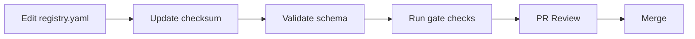
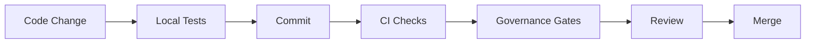
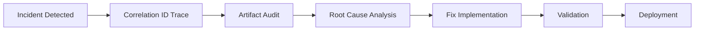

# Governance Policy

## Executive Summary

This document defines the governance framework for the AdvancedRules system, establishing quality gates, compliance requirements, and operational standards to ensure system reliability, security, and maintainability.

## Governance Principles

### 1. Defense in Depth
Multiple layers of validation and verification at each stage of the development and deployment pipeline.

### 2. Fail-Safe Defaults
System defaults to safe states; explicit authorization required for potentially dangerous operations.

### 3. Continuous Validation
Automated checks run continuously to detect drift, degradation, or non-compliance.

### 4. Traceable Operations
All operations are logged with correlation IDs for complete auditability.

## Quality Gates

### Pre-Commit Gates

#### Code Quality
- **Linting**: All code must pass flake8 checks
- **Formatting**: Code must be formatted with black
- **Type Checking**: MyPy validation (warnings allowed, errors blocked)

#### Test Coverage
- **Unit Tests**: Minimum 80% coverage for critical modules
- **Integration Tests**: All API endpoints and workflows covered
- **Smoke Tests**: Basic functionality verification

### Pre-Merge Gates (Required)

#### 1. Registry Validation ✅
- YAML syntax validation
- Schema compliance check
- Checksum verification
- ID normalization verification

**Enforcement**: Automated via `.github/workflows/governance.yml`

#### 2. Gate Evaluator ✅
- Precondition validation
- State verification
- Domain attachment checks
- Required artifact validation

**Enforcement**: `tools/gates/gate_evaluator.py` tests must pass

#### 3. Scoring Pipeline ✅
- Adapter functionality verification
- Legacy format support
- Canonical format validation
- Consistency between formats

**Enforcement**: Scoring smoke tests in CI

#### 4. Artifact Audit ✅
- Hash verification
- Tamper detection
- Provenance tracking
- Correlation linkage

**Enforcement**: `tools/artifacts/auditor.py` validation

#### 5. Instrumentation ✅
- Trace ID injection
- Correlation ID propagation
- Sensitive data redaction
- Event structure validation

**Enforcement**: Instrumentation tests must pass

#### 6. E2E Orchestration ✅
- Full workflow execution
- State transitions
- Event logging
- Component integration

**Enforcement**: End-to-end test in CI

### Post-Merge Gates

#### Continuous Monitoring
- Performance metrics collection
- Error rate monitoring
- Resource utilization tracking
- Security scanning

#### Periodic Audits
- Weekly: Artifact integrity check
- Monthly: Full system audit
- Quarterly: Security review

## Compliance Requirements

### Data Protection

#### Sensitive Data Handling
```yaml
Requirements:
  - PII must be redacted in logs
  - Passwords never stored in plain text
  - API keys must be masked
  - Credit card data must be tokenized
  
Enforcement:
  - Automated redaction via tools/instrumentation/redactor.py
  - Environment variable: ENABLE_REDACTION=true (default)
```

#### Data Retention
- Event logs: 90 days
- Audit logs: 1 year
- Artifacts: 30 days (unless marked for retention)

### Security Standards

#### Authentication & Authorization
- All operations require correlation ID
- Command execution requires allowlist approval
- State changes require gate validation

#### Cryptographic Requirements
- SHA-256 for file hashing
- UUID v4 for correlation IDs
- Signed registry with checksum verification

### Operational Standards

#### Deployment Requirements
```yaml
Pre-deployment:
  - All CI checks must pass
  - Registry checksum must be valid
  - No critical vulnerabilities in dependencies
  
During deployment:
  - Dry-run mode by default
  - Explicit ALLOW_RUN=1 for execution
  - Rollback capability required
  
Post-deployment:
  - Smoke tests must pass
  - Monitoring alerts configured
  - Incident response plan activated
```

#### Change Management
1. All changes require pull request
2. Minimum 1 reviewer approval
3. All CI checks must pass
4. Documentation must be updated

## Branch Protection Rules

### Main Branch
```yaml
Protection Rules:
  - Require pull request reviews: 1
  - Dismiss stale reviews: true
  - Require status checks:
    - CI Pipeline
    - Governance Quality Gates
    - Registry Validation
    - Gate Evaluator
    - Scoring Validation
  - Require branches up to date: true
  - Require conversation resolution: true
  - Require signed commits: recommended
  - Include administrators: false
```

### Develop Branch
```yaml
Protection Rules:
  - Require pull request reviews: 1
  - Require status checks:
    - CI Pipeline
    - Unit Tests
  - Allow force pushes: false
  - Allow deletions: false
```

## Governance Workflows

### 1. Registry Update Workflow


### 2. Code Change Workflow


### 3. Incident Response Workflow


## Monitoring & Alerting

### Key Metrics
| Metric | Threshold | Action |
|--------|-----------|--------|
| Gate Pass Rate | < 95% | Investigation required |
| Registry Checksum Failures | > 0 | Immediate investigation |
| Redaction Failures | > 1% | Review redaction patterns |
| E2E Test Success Rate | < 99% | Block deployments |
| Artifact Tampering | Any | Security incident |

### Alert Channels
- **Critical**: PagerDuty / On-call
- **High**: Slack #alerts channel
- **Medium**: Email to team
- **Low**: Dashboard notification

## Exceptions & Waivers

### Emergency Override Process
1. Document the emergency and justification
2. Get approval from 2 senior engineers
3. Use `EMERGENCY_OVERRIDE=true` environment variable
4. Create incident report within 24 hours
5. Conduct post-mortem within 72 hours

### Temporary Waivers
- Maximum duration: 7 days
- Requires written justification
- Must have remediation plan
- Tracked in `waivers.log`

## Audit Trail Requirements

### What to Log
- All state transitions
- All command executions
- All gate evaluations
- All artifact operations
- All configuration changes

### Log Format
```json
{
  "timestamp": "ISO-8601",
  "correlation_id": "UUID",
  "trace_id": "UUID",
  "type": "event_type",
  "actor": "system|user",
  "action": "action_taken",
  "result": "success|failure",
  "metadata": {}
}
```

### Log Retention
- Production: 1 year
- Staging: 6 months
- Development: 30 days

## Compliance Checklist

### Daily
- [ ] CI pipeline green
- [ ] No security alerts
- [ ] Artifact audit passing

### Weekly
- [ ] Review failed gate evaluations
- [ ] Check redaction effectiveness
- [ ] Validate registry checksum

### Monthly
- [ ] Full system audit
- [ ] Dependency updates
- [ ] Security patches applied
- [ ] Documentation review

### Quarterly
- [ ] Security assessment
- [ ] Performance review
- [ ] Governance policy update
- [ ] Training and awareness

## Enforcement Mechanisms

### Automated Enforcement
1. **GitHub Actions**: Runs on every push/PR
2. **Pre-commit Hooks**: Local validation
3. **Branch Protection**: Prevents direct pushes
4. **Registry Checksum**: Prevents tampering
5. **Gate Evaluator**: Blocks invalid operations

### Manual Reviews
1. **Code Reviews**: Required for all changes
2. **Security Reviews**: For sensitive changes
3. **Architecture Reviews**: For significant changes

## Responsibilities

### Development Team
- Write compliant code
- Maintain test coverage
- Update documentation
- Respond to alerts

### DevOps Team
- Maintain CI/CD pipeline
- Monitor system health
- Manage deployments
- Incident response

### Security Team
- Security reviews
- Vulnerability assessments
- Incident investigation
- Policy updates

### Management
- Resource allocation
- Policy approval
- Exception authorization
- Compliance reporting

## Version History

| Version | Date | Author | Changes |
|---------|------|--------|---------|
| 1.0.0 | 2024-01-15 | System | Initial governance policy |
| 1.1.0 | 2024-01-20 | System | Added instrumentation requirements |
| 1.2.0 | 2024-01-25 | System | Enhanced quality gates |

## References

- [NIST Cybersecurity Framework](https://www.nist.gov/cyberframework)
- [ISO 27001 Standards](https://www.iso.org/isoiec-27001-information-security.html)
- [OWASP Security Guidelines](https://owasp.org/)
- [CIS Controls](https://www.cisecurity.org/controls)

## Contact

For questions or exceptions regarding this governance policy:
- Email: governance@advancedrules.com
- Slack: #governance-help
- Emergency: Use PagerDuty

---

*This policy is enforced automatically via CI/CD pipelines and must be reviewed quarterly.*